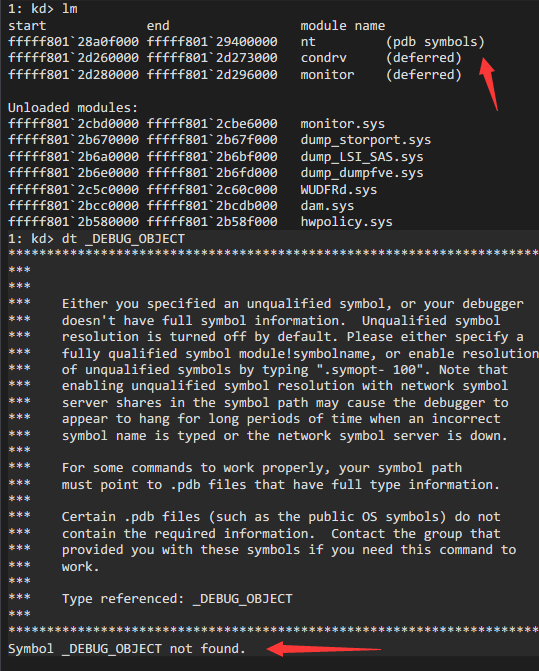
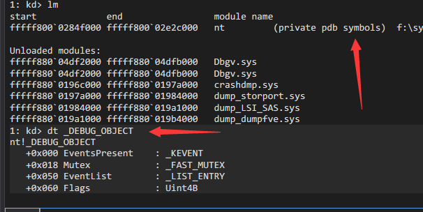
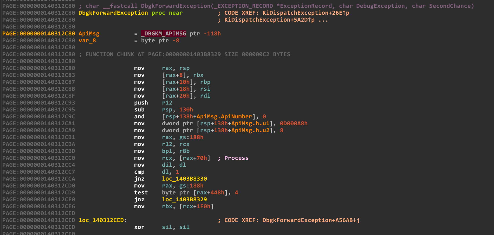
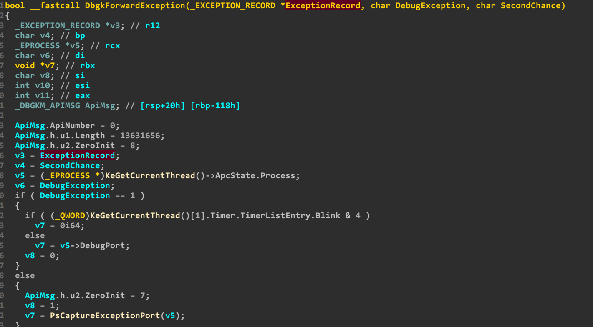

# WindowsKernelPrivateSymbolsDump

#### 相当一部分windows内核结构体并不会出现在公有符号中

#### A considerable part windows kernel struct does not appear in public symbols

#### 列如_DEBUG_OBJECT结构 该结构在windows公有符号中无法搜索

#### Such as the _DEBUG_OBJECT structure. This structure cannot be searched in windows public symbols

<h1 align="center">
	
</h1>

#### 而实际上 该结构在win7 7600中为

#### In fact, the structure in win7 7600 is

```cpp
typedef struct _DEBUG_OBJECT
{
	/* 0x0000 */ struct _KEVENT EventsPresent;
	/* 0x0018 */ struct _FAST_MUTEX Mutex;
	/* 0x0050 */ struct _LIST_ENTRY EventList;
	/* 0x0060 */ unsigned long Flags;
	/* 0x0064 */ long __PADDING__[1];
} DEBUG_OBJECT, *PDEBUG_OBJECT; /* size: 0x0068 */
```

#### 使用windbg加载私有符号进行验证

#### Use windbg to load private symbols for verification

<h1 align="center">
	
	<br>
	<br>
</h1>

#### 同理还有更多结构体被隐藏 他们均不会出现在公共符号中 如果用IDA加载私有符号 则情况如下(IDA伪代码未做任何修改 只是单纯的加载私有NT内核符号)

#### In the same way, there are more structures that are hidden and they will not appear in public symbols. If you use IDA to load private symbols, the situation is as follows (IDA pseudo-code has not been modified, but only private NT kernel symbols are loaded)

<h1 align="center">
	
	<br>
	<br>
</h1>

<h1 align="center">
	
	<br>
	<br>
</h1>

#### 转储来源项目:https://github.com/wbenny/pdbex (该项目转储自带部分BUG 对私有符号兼容性有一定问题 所以部分结构可能出现小差错)

#### The dump source project: https://github.com/wbenny/pdbex (this project dump comes with some bugs and has certain problems with the compatibility of private symbols, so some structures may have some problem)

#### 如需其他内核驱动模块转储请留言

#### If you need to dump other kernel driver modules, please leave a message


## 欢迎加入古典文学社(群名经常换不要在意 

### 行业交流 职位内推 资源共享 情报互换

### 当前群成员90人左右 国内大厂全覆盖 8成以上均为安全岗在职(逆向 内核 渗透 工作经验从在校学生0经验到20年以上巨佬均有

### 群内已举办过4次以上线下聚餐 不少群成员线下也相互认识

### 邀请制+审核制进群(群成员邀请是最方便的进群方式 渗透岗只接受部分群成员邀请进群

<h1 align="center">
	
	<br>
	<br>
</h1>

##### 加入微信群需先加入QQ群